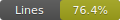

# Matrix Workspace

Monorepo with two Rust crates:

- **Lorenzo**: Generic N-D matrix & vector algebra (construction, arithmetic, linear combination, interpolation, dot / Hermitian dot, norms, cosine similarity, cross product (3D), generalized matrix×matrix and matrix×vector contraction, rank‑1 scalar contraction).
- **Samuele**: (currently empty logic / example placeholder) – shows zero coverage until tests are added.

## Features (Lorenzo)

- Vector & N-D matrix with flat storage + shape/strides
- Nested construction (`try_from_nested`), unchecked variant for tests
- Add / Sub / Scale for vectors & matrices (owned + assign variants)
- Linear combination & linear interpolation (lerp)
- Dot product (real) + Hermitian dot (complex)
- Unified norms (L1 / L2 / Linf) via a single `Magnitude` abstraction
- Cosine similarity (safe with clamp)
- Cross product (3D, panics otherwise)
- General tensor-style matmul (last axis × first axis) for any rank >=1
- Matrix × Vector contraction & borrowed variants (no unnecessary moves)
- Rank‑1 matrix · vector scalar contraction (`dot_vector`)
- Extensive tests (panic conditions included)

## Test Coverage (auto-updated on push to `main`)

The CI workflow runs `cargo llvm-cov` and rewrites the tables below. Do not edit between the markers manually.

### Per-file coverage
<!-- COVERAGE:PER-FILE-START -->
| Crate | File | Function Coverage | Line Coverage | Region Coverage | Branch Coverage |
|-------|------|-------------------|---------------|-----------------|-----------------|
| Lorenzo | Lorenzo/src/add_sub_scale.rs | 100.00% | 100.00% | 100.00% | 100.00% |
| Lorenzo | Lorenzo/src/cosine.rs | 100.00% | 100.00% | 100.00% | 100.00% |
| Lorenzo | Lorenzo/src/cross_prod.rs | 100.00% | 100.00% | 100.00% | 100.00% |
| Lorenzo | Lorenzo/src/determinant.rs | 100.00% | 91.53% | 94.07% | 65.00% |
| Lorenzo | Lorenzo/src/dot_prod.rs | 100.00% | 100.00% | 100.00% | 100.00% |
| Lorenzo | Lorenzo/src/inverse.rs | 100.00% | 94.12% | 91.29% | 90.00% |
| Lorenzo | Lorenzo/src/linear_combo.rs | 100.00% | 100.00% | 100.00% | 100.00% |
| Lorenzo | Lorenzo/src/linear_inter.rs | 100.00% | 100.00% | 100.00% | 100.00% |
| Lorenzo | Lorenzo/src/linear_map.rs | 97.22% | 96.27% | 97.52% | 70.83% |
| Lorenzo | Lorenzo/src/main.rs | 82.35% | 28.52% | 34.22% | — |
| Lorenzo | Lorenzo/src/my_mat.rs | 85.71% | 88.77% | 90.92% | 73.91% |
| Lorenzo | Lorenzo/src/my_vect.rs | 100.00% | 100.00% | 99.10% | 100.00% |
| Lorenzo | Lorenzo/src/norm.rs | 96.55% | 96.97% | 97.80% | — |
| Lorenzo | Lorenzo/src/projection.rs | 100.00% | 100.00% | 100.00% | 50.00% |
| Lorenzo | Lorenzo/src/rank.rs | 100.00% | 100.00% | 100.00% | 100.00% |
| Lorenzo | Lorenzo/src/row_echelon.rs | 100.00% | 98.32% | 99.23% | 83.33% |
| Lorenzo | Lorenzo/src/trace.rs | 100.00% | 100.00% | 100.00% | 100.00% |
| Lorenzo | Lorenzo/src/transpose.rs | 100.00% | 100.00% | 100.00% | 100.00% |
| Samuele | Samuele/src/main.rs | 0.00% | 0.00% | 0.00% | — |
| Samuele | Samuele/src/matrix.rs | 0.00% | 0.00% | 0.00% | — |
| Samuele | Samuele/src/vector.rs | 0.00% | 0.00% | 0.00% | — |
<!-- COVERAGE:PER-FILE-END -->

### Per-crate totals
<!-- COVERAGE:CRATE-START -->
| Crate | Function Coverage | Line Coverage | Region Coverage | Branch Coverage |
|-------|-------------------|---------------|-----------------|-----------------|
| Lorenzo | 96.08% | 83.60% | 84.59% | 80.00% |
| Samuele | 0.00% | 0.00% | 0.00% | — |
<!-- COVERAGE:CRATE-END -->

### Workspace total
<!-- COVERAGE:WORKSPACE-START -->
| Scope | Function Coverage | Line Coverage | Region Coverage | Branch Coverage |
|-------|-------------------|---------------|-----------------|-----------------|
| Workspace | 91.59% | 82.07% | 83.63% | 80.00% |
<!-- COVERAGE:WORKSPACE-END -->

Branch coverage is captured using `cargo +nightly llvm-cov --branch`, so the Branch column reflects real execution percentages (nightly toolchain required).

### Workspace badges
<!-- COVERAGE:BADGES-START -->
   
<!-- COVERAGE:BADGES-END -->

## Keeping Coverage Updated

CI regenerates `lcov.info`, `coverage.svg`, and (future) can patch this README automatically. To enable _automatic README coverage refresh_, we can add a step committing updated metrics. (Currently this table is static; open an issue if you want it auto-updated.)

## Local Coverage Commands

```bash
# HTML report (opens browser)
cargo +nightly llvm-cov --workspace --branch --html --open

# LCOV file (for VS Code Coverage Gutters)
cargo +nightly llvm-cov --workspace --branch --lcov --output-path lcov.info

# Summary text
cargo +nightly llvm-cov --workspace --branch --summary-only

# JSON for tooling
tool="coverage-summary.json"; cargo +nightly llvm-cov --workspace --branch --summary-only --json --output-path "$tool"; cat "$tool"
```

## Enforce Minimum Coverage

CI runs:

```bash
bash scripts/enforce_coverage.sh 80 lcov.info
```

Adjust threshold in the workflow or use a matrix for multiple levels.

## Generating the Badge Locally

```bash
bash scripts/coverage_badge.sh lcov.info coverage.svg
```

Then embed in docs:

```markdown

```

## Roadmap / Possible Improvements

- Auto-update README coverage table in CI
- Per-file threshold gating (fail if any core module < X%)
- Benchmarks (criterion) and performance coverage
- Add branch coverage via additional instrumentation if needed
- Samuele crate: add examples/tests or remove to reduce noise

## Development

Run all tests fast:

```bash
cargo test --workspace
```

Run a single test file:

```bash
cargo test -p Lorenzo name_fragment
```

---
Generated manually (initial version). Enable automated updates to keep numbers fresh.
